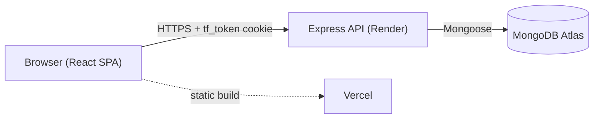
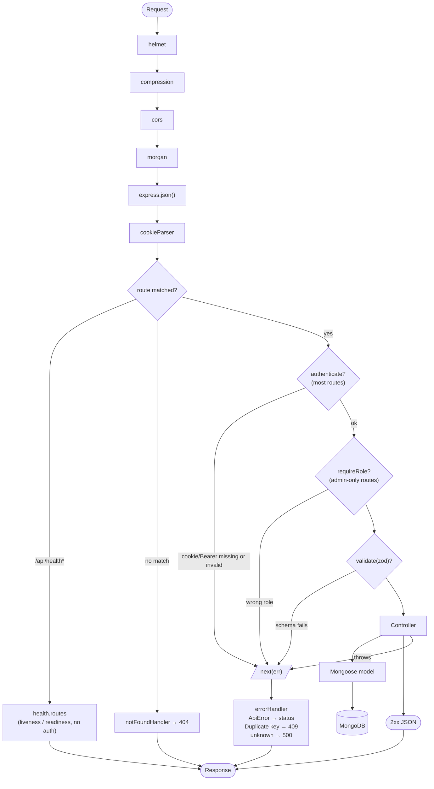

# TaskForge — Architecture

System topology and request flow. For data model and feature scope see [`PLAN.md`](./PLAN.md); for deploy config see [`DEPLOYMENT.md`](./DEPLOYMENT.md).

## System

Cookie-based auth, split origins: the SPA and API are separate deployments, so every request carries the `tf_token` HttpOnly cookie cross-site (`SameSite=None; Secure` in production — see `DEPLOYMENT.md`).

## Request flow

`authenticate` (`middleware/auth.ts`) loads the user by the JWT's `sub` on every request — no session cache. `validate` (`middleware/validate.ts`) runs before or after `authenticate` depending on the route: auth routes (register/login) validate first since there's no user yet; task/user routes authenticate first, then validate per-endpoint. Every controller is wrapped in `asyncHandler` so a thrown/rejected error always reaches `errorHandler`, never crashes the process.

## Authorization

Role-based visibility is enforced in `controllers/task.controller.ts`, not middleware, because it depends on task ownership — see `CLAUDE.md` and `PLAN.md` for `visibilityFilter`/`canView`/`canManage`. Out-of-scope tasks return `404`, never `403` — existence isn't leaked.

## Known constraint

Everything above is single-tenant: `visibilityFilter` scopes by `createdBy`/`assignedTo`, not by any team/workspace boundary — an admin sees every task in the database. See [`SCALING.md`](./SCALING.md) for the workspace model that replaces this.
