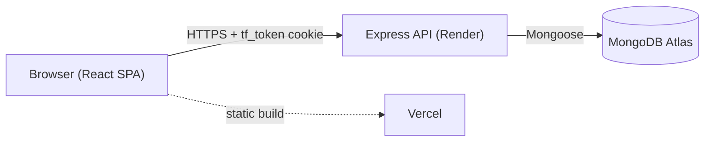
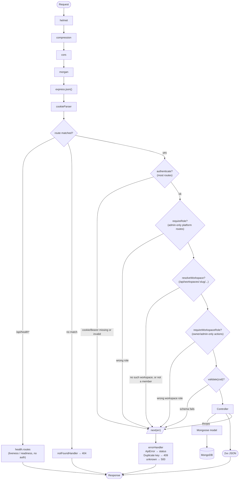

# TaskForge — Architecture

System topology and request flow. For data model and feature scope see [`PLAN.md`](./PLAN.md); for deploy config see [`DEPLOYMENT.md`](./DEPLOYMENT.md).

## System

Cookie-based auth, split origins: the SPA and API are separate deployments, so every request carries the `tf_token` HttpOnly cookie cross-site (`SameSite=None; Secure` in production — see `DEPLOYMENT.md`).

## Request flow

`authenticate` (`middleware/auth.ts`) loads the user by the JWT's `sub` on every request — no session cache. `resolveWorkspace` (`middleware/workspace.ts`) then loads the workspace named in `:slug` and the caller's membership, attaching `req.workspace`/`req.membership`; non-existent workspaces and non-members both 404. `validate` (`middleware/validate.ts`) runs wherever a route needs it — before `authenticate` on `/api/auth/register|login` since there's no user yet, after everything else elsewhere. Every controller is wrapped in `asyncHandler` so a thrown/rejected error always reaches `errorHandler`, never crashes the process.

## Authorization

Workspace-scoped, enforced by `services/authz.ts` once `req.workspace`/`req.membership` are resolved — not by role middleware alone, since some rules (`canManage`) also depend on task ownership. See `PLAN.md` for `scopeFilter`/`canView`/`canManage`/`canWrite`. Non-member workspace access and out-of-scope tasks both return `404`, never `403` — existence isn't leaked.

`User.role` (`admin`/`user`) is a platform-level flag only — it grants no tenant data access. All task/comment authorization comes from `WorkspaceMember.role` (`owner`/`admin`/`member`/`viewer`).

## Known constraint

The frontend hasn't been updated to expose any of this yet — no workspace switcher, no `/w/:slug` routes; it still calls the pre-Phase-1 API shape. See [`SCALING.md`](./SCALING.md) Phase 1 for what's left.
